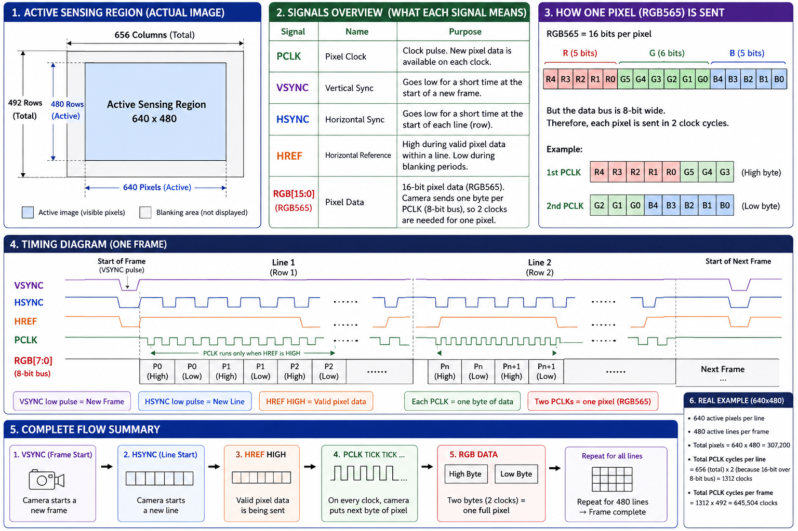
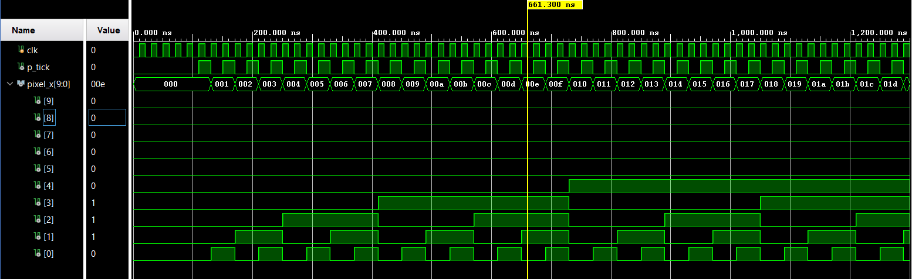
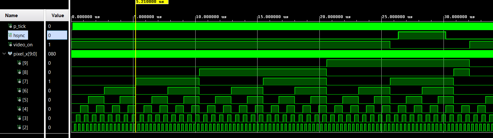
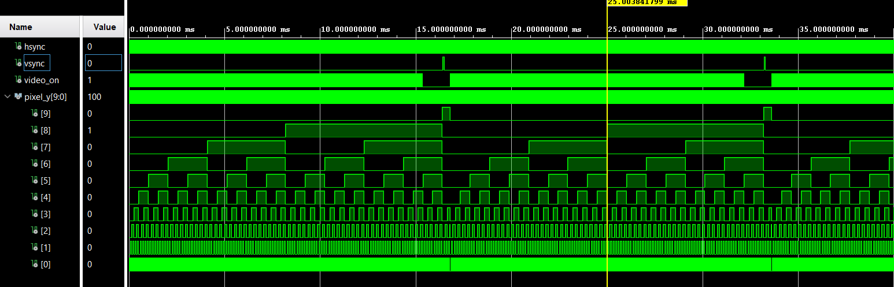
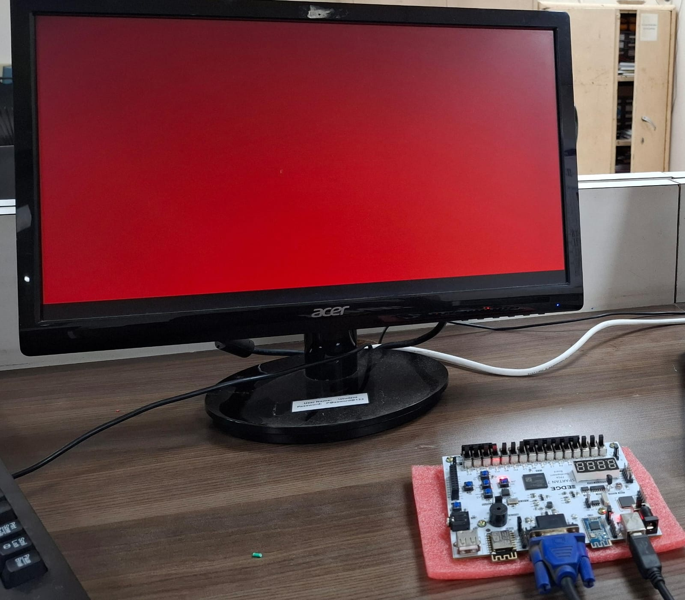
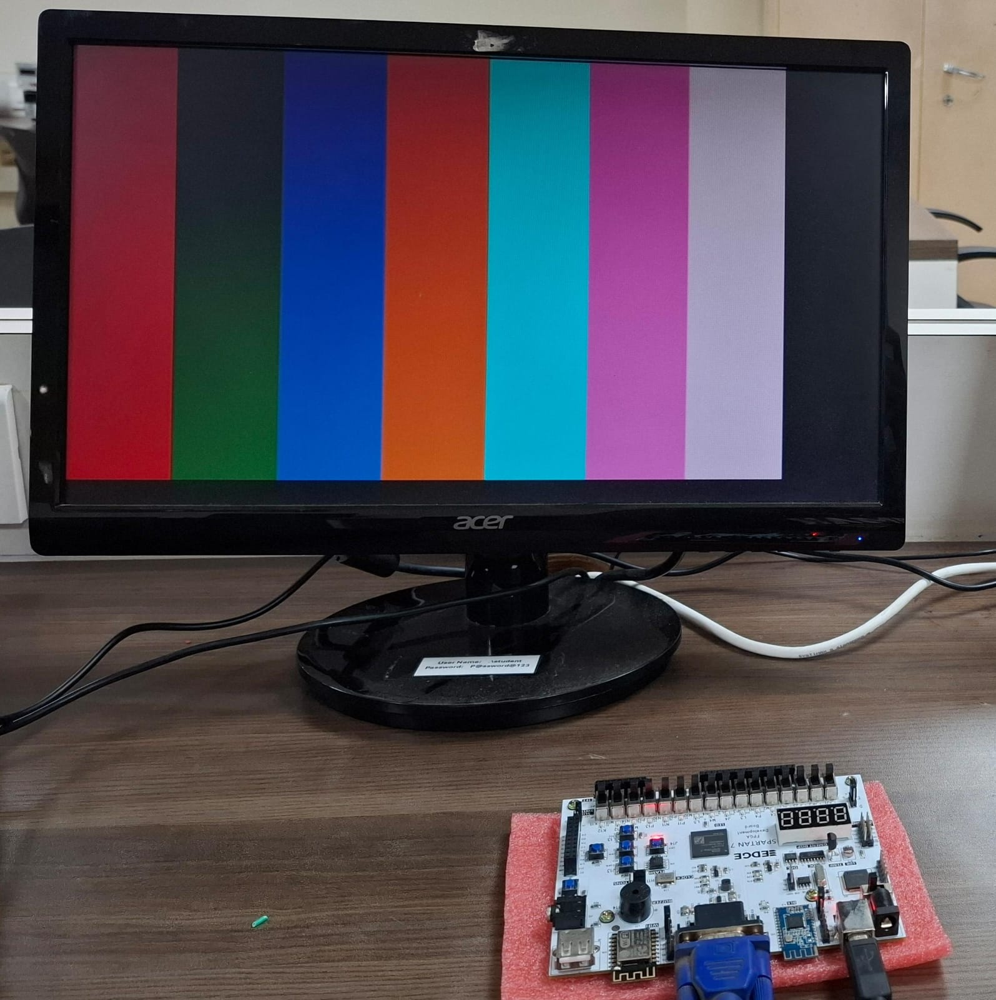

# FPGA-Based VGA Controller

A compact Verilog VGA timing controller for a **640×480 display at approximately 60 Hz**, designed around a **50 MHz system clock** and an effective **25 MHz pixel timing tick**. The project is simulated with **Xilinx Vivado/XSim** and includes waveform captures that document pixel, line, and frame timing.

> This repository implements VGA timing generation with simulation and documented physical-monitor output photos. It does not include framebuffer, image-processing, HDMI, or camera-interface features.

## Overview

The controller generates the timing signals and coordinates for a conventional 640×480 VGA raster:

- `hsync` — horizontal synchronization signal
- `vsync` — vertical synchronization signal
- `video_on` — asserted only during the visible 640×480 region
- `p_tick` — effective pixel timing event
- `pixel_x` — horizontal timing position, `0` to `799`
- `pixel_y` — vertical timing position, `0` to `524`

The main RTL is implemented in [`src/vga.v`](src/vga.v), with simulation provided by [`src/vga_tb.v`](src/vga_tb.v).

## Objectives

- Generate standard 640×480 VGA timing intervals.
- Derive an effective 25 MHz pixel timing event from a 50 MHz system clock.
- Advance horizontal and vertical counters only on the pixel timing event.
- Identify the active video region using `video_on`.
- Verify pixel-clock, horizontal-line, and frame-level behavior in Vivado/XSim.

## VGA Timing

VGA timing is divided into four consecutive regions:

**Active Video → Front Porch → Sync → Back Porch**

### Horizontal timing

| Region | Duration | Counter range |
|---|---:|---:|
| Active video | 640 pixels | `0–639` |
| Front porch | 16 pixels | `640–655` |
| Horizontal sync | 96 pixels | `656–751` |
| Back porch | 48 pixels | `752–799` |
| **Total** | **800 pixel timing events** | **`0–799`** |

The horizontal counter wraps after 800 pixel timing events.

### Vertical timing

| Region | Duration | Counter range |
|---|---:|---:|
| Active video | 480 lines | `0–479` |
| Front porch | 10 lines | `480–489` |
| Vertical sync | 2 lines | `490–491` |
| Back porch | 33 lines | `492–524` |
| **Total** | **525 lines per frame** | **`0–524`** |

The vertical counter increments after a complete horizontal line and wraps after 525 lines.

## VGA Timing Diagram


This diagram illustrates the overall 640×480 VGA timing structure, including active display, front porch, sync/retrace interval, back porch, total pixels per line, total lines per frame, and the approximate pixel-clock requirement.

## HSYNC and VSYNC Behavior



The synchronization intervals occur outside the active video region, during blanking. Consequently, `video_on` is LOW while the controller is in the front porch, sync, or back porch portions of a line or frame. This means it is intentional for `hsync` or `vsync` to be active while `video_on` is LOW; those signals describe different portions of the raster timing.

In the RTL:

```text
video_on = 1 when pixel_x < 640 and pixel_y < 480
```

Therefore, `video_on` is HIGH only in the visible 640×480 region.

## RTL Design

The `vga` module uses:

- A 50 MHz input clock, `clk`.
- An active-high asynchronous reset, `reset`.
- `mod2_reg` as a divide-by-2 style toggle mechanism.
- A horizontal counter that ranges from `0` to `799`.
- A vertical counter that ranges from `0` to `524`.
- Registered synchronization outputs for `hsync` and `vsync`.

The effective pixel timing event is derived as follows:

```text
50 MHz / 2 = 25 MHz
```

The horizontal counter advances on the pixel timing event. The vertical counter advances when the pixel timing event coincides with the end of a horizontal line.

The repository also contains `src/clk_div_mmcm.xci`. The Vivado project-generation script references this IP configuration, while the `vga` RTL shown above generates its effective pixel timing event through `mod2_reg`.

## Timing Calculations

Using a 25 MHz effective pixel frequency:

| Quantity | Calculation | Result |
|---|---|---:|
| System-clock period | `1 / 50 MHz` | `20 ns` |
| Pixel period | `1 / 25 MHz` | `40 ns` |
| Horizontal period | `800 × 40 ns` | `32 µs` |
| Frame period | `525 × 32 µs` | `16.8 ms` |
| Frame frequency | `1 / 16.8 ms` | `≈59.52 Hz` |

The resulting frame rate is approximately 60 Hz, not an exact 60.000 Hz refresh rate.

## Testbench

The testbench in [`src/vga_tb.v`](src/vga_tb.v):

- Generates a 50 MHz clock with `always #10 clk = ~clk;`.
- Starts with reset asserted.
- Holds reset for 100 ns, corresponding to five positive clock edges.
- Releases reset at 100 ns, on a negative clock edge.
- Runs for approximately 20 ms after reset release.
- Stops with `$stop` after the simulation interval.

Releasing reset on the negative edge intentionally avoids deasserting reset at the same time as a positive clock edge, preventing an unnecessary reset-deassertion race in simulation. The simulation interval is long enough to capture more than one complete frame.

## Simulation Results

The waveform screenshots are shown at different time scales. Viewing the complete approximately 20 ms simulation in one window would make the high-frequency pixel timing difficult to read.

### Pixel clock verification



**File:** `results/vga_pixel_clock.png`

**Signals:** `clk`, `p_tick`, `pixel_x`  

This view verifies the 50 MHz system clock, the effective 25 MHz pixel timing event, and pixel-counter activity relative to `p_tick`.

### Horizontal timing verification



**File:** `results/vga_horizontal_timing.png`

**Signals:** `p_tick`, `hsync`, `video_on`, `pixel_x`  

This view shows one complete horizontal line:

```text
640 active pixels
+ 16 front-porch pixels
+ 96 sync pixels
+ 48 back-porch pixels
= 800 pixel timing events
```

The expected line period is `32 µs`. `video_on` is HIGH only in the active 640-pixel region, while HSYNC occurs later in the blanking interval. Their behavior in separate timing regions is expected and is not an error.

### Frame timing verification



**File:** `results/vga_frame_timing.png`

**Signals:** `hsync`, `vsync`, `video_on`, `pixel_y`  

This view verifies complete frame-level timing and vertical synchronization:

```text
480 active lines
+ 10 front-porch lines
+ 2 sync lines
+ 33 back-porch lines
= 525 lines per frame
```

The expected frame period is `16.8 ms`, corresponding to a frame frequency of approximately `59.52 Hz`.

### Physical monitor display evidence

The following JPEG photos document the VGA controller output as displayed on a physical monitor. These images provide hardware-level visual evidence in addition to the Vivado/XSim waveform screenshots above.



**File:** `results/vga_monitor_1.jpeg`



**File:** `results/vga_monitor_2.jpeg`

### Waveform configuration

`results/vga_tb_behav.wcfg` is the Vivado/XSim waveform configuration file. It preserves the waveform signal setup and view configuration; it is not an image or a simulation-result screenshot.

## Documentation vs. Results

The repository separates explanatory material from simulation evidence:

- `docs/` contains reference diagrams explaining VGA timing concepts and the relationship between active video and synchronization intervals.
- `results/` contains waveform screenshots, physical-monitor output photos, and the Vivado/XSim waveform configuration generated for the Verilog testbench.

The images in `docs/` illustrate the expected VGA concepts, while the images in `results/` document both simulation behavior and physical monitor display output for the implemented RTL.

## Build / Reproduce

The repository includes [`scripts/vga_build.tcl`](scripts/vga_build.tcl), a Vivado-generated Tcl script for recreating the project setup. Generated Vivado project files are intentionally excluded from version control.

The repository retains the RTL, testbench, Vivado IP configuration, waveform configuration, simulation screenshots, documentation diagrams, and Tcl project-generation script needed to reproduce the documented project setup. The script does not automatically launch synthesis or implementation runs; those runs must be started separately if required.

## Repository Structure

```text
VGA/
├── src/
│   ├── vga.v
│   ├── vga_tb.v
│   └── clk_div_mmcm.xci
├── docs/
│   ├── VGA_Timing Diagram.png
│   └── VSYNC_HSYNC.png
├── results/
│   ├── vga_pixel_clock.png
│   ├── vga_horizontal_timing.png
│   ├── vga_frame_timing.png
│   ├── vga_monitor_1.jpeg
│   ├── vga_monitor_2.jpeg
│   └── vga_tb_behav.wcfg
├── scripts/
│   ├── vga_build.tcl
│   ├── vga_def_val.txt
│   └── vga_dump.txt
├── README.md
└── .gitignore
```

## Future Improvements

Potential next steps, outside the current implementation, include:

- Add a pixel or color-generation datapath for visible test patterns.
- Parameterize the timing constants for additional VGA modes.
- Add assertions or automated checks for line and frame boundaries.
- Document and validate a specific FPGA-board integration separately from the timing-controller simulation.

## License

See [`LICENSE`](LICENSE) for the repository license information.
